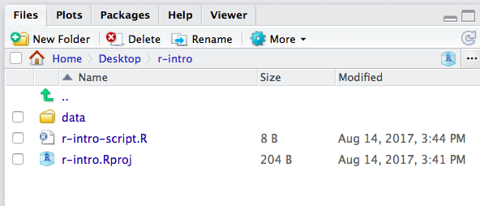

```{r, echo=FALSE, purl=FALSE, message = FALSE}
knitr::opts_chunk$set(results='hide', comment = "#>", purl = FALSE)
```

# R and Rstudio {#backgroud}


> Learning Objectives
>
> - Be familiar with reasons to use R.
> - Understand how R relates to RStudio.
> * Be able to navigate the RStudio interface including the Script, Console, Environment, Help, Files, and Plots windows.
> * Create an R Project in RStudio.
> * Set a "working" directory.
> * Send commands from the Script window to the Console in RStudio.

------------

## What is R? What is RStudio?

The term "R" is used to refer to both the programming language to write scripts and the software ("environment") that interprets the scripts written in R. It is an alternative to statistical packages like SAS, SPSS, or Stata, which lets you perform a wide variety of data analysis, statistics, and visualization. 

RStudio is currently a very popular way to not only write your R scripts but
also to interact with the R software. To function correctly, RStudio needs R and
therefore both need to be installed on your computer.


## Why learn R?

### R does not involve lots of pointing and clicking, and that's a good thing

The learning curve might be steeper than with other software, but with R, the
results of your analysis does not rely on remembering a succession of pointing
and clicking, but instead on a series of written commands, and that's a good
thing! So, if you want to redo your analysis because you collected more data,
you don't have to remember which button you clicked in which order to obtain
your results, you just have to run your script again.

Working with scripts makes the steps you used in your analysis clear, and the
code you write can be inspected by someone else who can give you feedback and
spot mistakes.

Working with scripts forces you to have a deeper understanding of what you are
doing, and facilitates your learning and comprehension of the methods you use.

### R code is great for reproducibility

Reproducibility is when someone else (including your future self) can obtain the
same results from the same dataset when using the same analysis.

R integrates with other tools to generate manuscripts from your code. If you
collect more data, or fix a mistake in your dataset, the figures and the
statistical tests in your manuscript are updated automatically.

An increasing number of journals and funding agencies expect analyses to be
reproducible, so knowing R will give you an edge with these requirements.


### R is interdisciplinary and extensible

With 10,000+ packages that can be installed to extend its capabilities, R
provides a framework that allows you to combine statistical approaches from many
scientific disciplines to best suit the analytical framework you need to analyze your
data. For instance, R has packages for image analysis, mapping, time series, text mining, and a lot more.


### R works on data of all shapes and sizes

The skills you learn with R scale easily with the size of your dataset. Whether
your dataset has hundreds or millions of lines, it won't make much difference to
you.

R is designed for data analysis. It comes with special data structures and data
types that make handling of missing data and statistical factors convenient.

R can connect to spreadsheets, databases, and many other data formats, on your
computer or on the web.


### R produces high-quality graphics

The plotting functionalities in R are endless, and allow you to adjust any
aspect of your graph to convey most effectively the message from your data.


### R has a large community

Thousands of people use R daily. Many of them are willing to help you through
mailing lists and websites such as [Stack Overflow](https://stackoverflow.com/questions/tagged/r).


### Not only is R free, but it is also open-source and cross-platform

Anyone can inspect the source code to see how R works. Because of this
transparency, there is less chance for mistakes, and if you (or someone else)
find some, you can report and fix bugs.


## Knowing your way around RStudio

Let's start by learning about [RStudio](https://www.rstudio.com/), which is an
Integrated Development Environment (IDE) for working with R.

The RStudio IDE open-source product is free under the
[Affero General Public License (AGPL) v3](https://www.gnu.org/licenses/agpl-3.0.en.html).
The RStudio IDE is also available with a commercial license and priority email
support from RStudio, Inc.

We will use RStudio IDE to write code, navigate the files on our computer,
inspect the variables we are going to create, and visualize the plots we will
generate. RStudio can also be used for other things (e.g., version control,
developing packages, writing Shiny apps) that we will not cover during the
workshop.


```{r RStudio-GUI, echo=FALSE, results='asis', out.width='100%', fig.cap='The RStudio Interface'}
knitr::include_graphics('img/rstudio-screenshot.png')
```


RStudio is divided into 4 "Panes": the **Source** for your scripts and documents
(top-left, in the default layout), the R **Console** (bottom-left), your
**Environment/History** (top-right), and your
**Files/Plots/Packages/Help/Viewer** (bottom-right). The placement of these
panes and their content can be customized (see menu, Tools -> Global Options ->
Pane Layout). One of the advantages of using RStudio is that all the information
you need to write code is available in a single window. Additionally, with many
shortcuts, autocompletion, and highlighting for the major file types you use
while developing in R, RStudio will make typing easier and less error-prone.

## How to start an R project

```{r, echo=FALSE, purl=TRUE}
### How to start an R project
```

It is good practice to keep a set of related data, analyses, and text
self-contained in a single folder. When working with R and RStudio you typically want that single top folder to be the folder you are working in. In order to tell R this, you will want to set that folder as  your **working directory**. Whenever you refer to other scripts or data or directories contained within the working directory you can then use *relative paths* to files that indicate
where inside the project a file is located. (That is opposed to absolute paths, which
point to where a file is on a specific computer). having everything contained in a single directory makes it
a lot easier to move your project around on your computer and share it with
others without worrying about whether or not the underlying scripts will still
work.

Whenever you create a project with RStudio it creates a working directory for you and remembers
its location (allowing you to quickly navigate to it) and optionally preserves
custom settings and open files to make it easier to resume work after a
break. Below, we will go through the steps for creating an "R Project" for this
workshop.

* Start RStudio
* Under the `File` menu, click on `New project`, choose `New directory`, then
  `Empty project`
* As directory (or folder) name enter `r-intro` and create project as subdirecory of your desktop folder: `~/Desktop`  
* Click on `Create project`
* Under the `Files` tab on the right of the screen, click on `New Folder` and
  create a folder named `data` within your newly created working directory (e.g., `~/r-intro/data`)
* Download the [code handout](./code-handout.R), place it in your working directory and rename it (e.g., `r-intro-script.R`).

Your working directory should now look like this:

```{r working-dir, echo=FALSE, results='asis', out.width='80%', fig.cap='What it should look like at the beginning of this lesson'}

```

If you ever need to set a different working directory you can use the RStudio interface like this:

```{r set-working-dir, echo=FALSE, results='asis', out.width='60%', fig.cap='How to set a working directory with the RStudio interface'}
knitr::include_graphics('img/setWD.png')
```

Alternatively, you can use the shortcut <kbd>`Ctrl`</kbd> + <kbd>`Shift`</kbd> + <kbd>`H`</kbd> to set a working directory in RStudio.

To set a working directory in R go to the Console and type:

```{r eval=FALSE}
setwd("Path/To/Your/Workingdirectory")
```

If you need to check which working directory R thinks it is in:

```{r eval=FALSE}
getwd()
```


### Organizing your working directory

Using a consistent folder structure across your projects will help keep things
organized, and will also make it easy to find/file things in the future. This
can be especially helpful when you have multiple projects. In general, you may
create directories (folders) for **scripts**, **data**, and **documents**.

 - **`data/`** Use this folder to store your raw data and intermediate
   datasets you may create for the need of a particular analysis. For the sake
   of transparency and [provenance](https://en.wikipedia.org/wiki/Provenance),
   you should *always* keep a copy of your raw data accessible and do as much
   of your data cleanup and preprocessing programmatically (i.e., with scripts,
   rather than manually) as possible. Separating raw data from processed data
   is also a good idea. For example, you could have subfolders in your `data` directory named
   `data/raw/`
   and `data/processed` that woudl contain the respective raw and processed files. I also like to log my data processing steps in a simple textfile that I keep there as well.
 - **`documents/`** If you are wroking on a paper this would be a place to keep outlines, drafts, and other
   text.
 - **`scripts/`** This would be the location to keep your R scripts. Again, depending on the complexity, you may want to add subfolders that contain, for example all the plotting scripts, or all the datas cleaning scripts.

You may want additional directories or subdirectories depending on your project
needs, but this is a good template to form the backbone of your working directory. 

## Interacting with R

The basis of programming is that we write down instructions for the computer to
follow, and then we tell the computer to follow those instructions. We write, or
*code*, instructions in R because it is a common language that both the computer
and we can understand. We call the instructions *commands* and we tell the
computer to follow the instructions by *executing* (also called *running*) those
commands.

There are two main ways of interacting with R: by using the **console** or by using
**script files** (plain text files that contain your code). 


### RStudio Console

The console pane in RStudio is the place where commands written in the R
language can be typed and executed immediately by the computer. It is also where
the results will be shown for commands that have been executed. You can type
commands directly into the console and press <kbd>`Enter`</kbd> to execute those commands,
but they will be forgotten when you close the session.

> <h3>Challenge</h3>
>
> - Use R to determine what your working directory is.
> - Use R to change your working directory to some other place. What do you notice in the RStudio Files window?
> - Use RStudio to change back to your previous working directory (r-intro) What do you notice in the RStudio Console?


### RStudio Script Editor

Because we want our code and workflow to be reproducible, it is better to type
the commands we want in the script editor, and save the script. This way, there
is a complete record of what we did, and anyone (including our future selves!)
can easily replicate the results on their computer.

RStudio allows you to execute commands directly from the script editor by using
the <kbd>`Ctrl`</kbd> + <kbd>`Enter`</kbd> shortcut (on Macs, <kbd>`Cmd`</kbd> +
<kbd>`Return`</kbd> will work, too). The command on the current line in the
script (indicated by the cursor) or all of the commands in the currently
selected text will be sent to the console and executed when you press
<kbd>`Ctrl`</kbd> + <kbd>`Enter`</kbd>. You can find other keyboard shortcuts in this [RStudio cheatsheet about the RStudio IDE](https://github.com/rstudio/cheatsheets/blob/master/source/pdfs/rstudio-IDE-cheatsheet.pdf).

At some point in your analysis you may want to check the content of a variable
or the structure of an object, without necessarily keeping a record of it in
your script. You can type these commands and execute them directly in the
console.  RStudio provides the <kbd>`Ctrl`</kbd> + <kbd>`1`</kbd> and
<kbd>`Ctrl`</kbd> + <kbd>`2`</kbd> shortcuts allow you to jump between the
script and the console panes.

### The R command prompt

If R is ready to accept commands, the R console by default shows a `>` prompt. If it
receives a command (by typing, copy-pasting or sent from the script editor using
<kbd>`Ctrl`</kbd> + <kbd>`Enter`</kbd>), R will try to execute it, and when
ready, will show the results and come back with a new `>` prompt to wait for new
commands.

If R is still waiting for you to enter more data because it isn't complete yet,
the console will show a `+` prompt. It means that you haven't finished entering
a complete command. This is because you have not 'closed' a parenthesis or
quotation, i.e. you don't have the same number of left-parentheses as
right-parentheses, or the same number of opening and closing quotation marks.
When this happens, and you thought you finished typing your command, click
inside the console window and press <kbd>`Esc`</kbd>; this will cancel the incomplete
command and return you to the `>` prompt.

