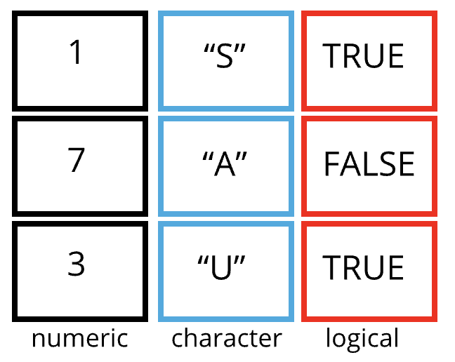

```{r, echo=FALSE, purl=FALSE, message = FALSE}
knitr::opts_chunk$set(results='hide', comment = "#>", purl = FALSE)
library(tidyverse)
```

# Working with tabular data in R{#data}

> Learning Objectives
>
  > * Load external data from a .csv file into a data frame in R with `read_csv()`
> * Find basic properties of a data frames including size, class or type of the columns, names of rows and columns by using `str()`, `nrow()`, `ncol()`, `dim()`, `length()` , `colnames()`, `rownames()`
> * Use `head()` and `tail()` to inspect rows of a data frame.
> * Generate summary statistics for a data frame
> * Use indexing to select rows and columns
> * Use logical conditions to select rows and columns 
> * Add columns and rows to a data frame
> * Manipulate categorical data with `factors`, `levels()` and `as.character()`
> * Change how character strings are handled in a data frame.
> * Format dates in R and calculate time differences
> - Use `df$new_col <- new_col` to add a new column to a data frame.
> - Use `cbind()` to add a new column to a data frame.
> - Use `rbind()` to add a new row to a data frame.
> - Use `na.omit()` to remove rows from a data frame with `NA` values.

------------

Data frames are the de facto data structure for tabular data in R, and what we use for data processing, statistics, and plotting.

A data frame is the representation of data in the format of a table where the columns are vectors that all have the same length. Data frames are analogous to the more familiar spreadsheet in programs such as Excel, with one key difference. Because columns are vectors, each column must contain a single type of data (e.g., characters, integers, factors). For example, here is a figure depicting a data frame comprising a numeric, a character, and a logical vector.


```{r data-frame, echo=FALSE, results='asis', out.width='80%', fig.cap='Structure of a data frame'}

```


As we have seen above, data frames can be created by hand, but most commonly they are generated by the functions like `read.csv()`, `read_csv()` or `read_table()` and others. These functions essentiallly import the tables or spreadsheets from your hard drive (or the web). We will now demonstrate how to import tabular data using `read_csv()`.


## Importing tabular data
  
```{r, echo=FALSE, purl=TRUE}
### Loading tabular data
```

We will take a CSV file as example. [What is a CSV file?](https://support.bigcommerce.com/articles/Public/What-is-a-CSV-file-and-how-do-I-save-my-spreadsheet-as-one)

You may know about [the Stanford Open Policing Project](https://openpolicing.stanford.edu) and we will be working with a sample dataset from their repository (https://openpolicing.stanford.edu/data/). The sample I extracted contains information about traffic stops for black and white drivers in the state of Mississippi during January 2013 to mid-July of 2016. 

First, we are going to use the R function `download.file()` to download the CSV file
that contains the traffic stop data, and we will use `read.csv()` to
load into memory the content of the CSV file as an object of class `data.frame`.

To download the data into your local `data/` subdirectory, run the following:
  
```{r, eval=FALSE, purl=TRUE}
download.file("http://bit.ly/MS_trafficstops_bw", "data/MS_trafficstops_bw.csv")
```


You are going to load the data in R’s memory using the function `read_csv()` from the `readr` package, which is part of the `tidyverse`; learn more about the tidyverse collection of packages (here)[https://www.tidyverse.org/]. `readr` gets installed as part as the `tidyverse` installation. When you load the `tidyverse` (`library(tidyverse)`), the core packages (the packages used in most data analyses) get loaded, including `readr.`


So lets make sure you have the `tidyverse` packages installed and loaded.

If you haven't done so already run the installation of `tidyverse` like this:

```{r install_tidyverse, echo=TRUE, eval=FALSE}
install.packages("tidyverse" , dependencies = TRUE) # this is only necessary once
```

Then load `tidyverse` into memory like this:

```{r load_tidyverse, echo=TRUE, eval=FALSE}
library(tidyverse) # do this whenever you need to access functions from the tidyverse packages 
```


You may have noticed that when you loaded the tidyverse package that you received the following message:

`── Conflicts ─────────────────────────────────────── tidyverse_conflicts() ──`
`✖ dplyr::filter() masks stats::filter()`
`✖ dplyr::lag()    masks stats::lag()`
`ℹ Use the conflicted package to force all conflicts to become errors`

This presents a good opportunity to talk about conflicts. Certain packages we load can end up introducing function names that are already in use by pre-loaded R packages. For instance, when we load the `tidyverse` package below, we will introduce two conflicting functions: `filter()` and `lag()`. This happens because `filter` and `lag` are already functions used by the `stats` package (already pre-loaded in R). What will happen now is that if we, for example, call the `filter()` function, R will use the `dplyr::filter()` version and not the `stats::filter()` one. This happens because, if conflicted, **by default R uses the function from the most recently loaded package**. Conflicted functions may cause you some trouble in the future, so it is important that we are aware of them so that we can properly handle them, if we want.

To do so, we can use the following functions from the conflicted package:

* `conflicted::conflict_scout()`: Shows us any conflicted functions.
* `conflict_prefer("function", "package_prefered")`: Allows us to choose the default function we want from now on.

It is also important to know that we can, at any time, just call the function directly from the package we want, such as `stats::filter()`.

Ok. With that out of the way you are now ready to load the data.


```{r, eval=TRUE,  purl=FALSE}
stops <- read_csv("data/MS_trafficstops_bw.csv")
```


If you were to type in the code above, it is likely that the `read.csv()` (note the dot!) function would appear in the automatically populated list of functions. This function is different from the `read_csv()` (note the underscore!) function, as it is included in the "base" packages that come pre-installed with R. Overall, `read.csv()` behaves similar to `read_csv()`, with a few notable differences. First, `read.csv()` coerces column names with spaces and/or special characters to different names (e.g. interview date becomes interview.date). Second, `read.csv()` stores data as a **data.frame**, where `read_csv()` stores data as a **tibble**. We prefer tibbles because they have nice printing properties among other desirable qualities. Read more about tibbles [here.](https://tibble.tidyverse.org/)

The second statement in the code above creates a data frame but doesn’t output any data because, as you might recall, assignments (`<-`) don’t display anything. (Note, however, that `read_csv` may show informational text about the data frame that is created.) 

So let's check out the data! We can type the name of the object `stops`:
  
```{r, results='show', purl=FALSE}
stops

## Try also:
# head(stops)
# view(stops)
```

`read_csv()` assumes that fields are delimited by commas. For other delimiters (like semicolon or tab) check out the help: `?read_csv`

Note that `read_csv()` loads the data as a so called "tibble". A tibble is an extended form of R data frames (as an object of multiple classes `tbl_df`, `tbl`, and `data.frame`). This may sound confusing, but it is really not anything you typically need to deal with when working the data. In fact, it makes it a little more convenient. 

As you may recall, a data frame in R is a special case of a list, and a representation of data where the columns are vectors that all have the same length. Because the columns are vectors, they all contain the same type of data (e.g., characters, integers, factors, etc.).

In this tibble you can see the type of data included in each column listed in an abbreviated fashion right below the column names. For instance, the `state` column is is of type character `<chr>`, the `stop_date` is in `<date>` format and `county_fips` are floating point numbers (abbreviated `<dbl>` for the word 'double').


## Inspecting data frames

```{r, echo=FALSE, purl=TRUE}
### Inspecting `data.frame` Objects
```

When calling a `tbl_df `object (like `stops` here), there is already a lot of information about our data frame being displayed such as the number of rows, the number of columns, the names of the columns, and as we just saw the class of data stored in each column. However, there are additional functions to extract this information from data frames. Here is a non-exhaustive list of some of these functions. Let’s try them out!

We already saw how the functions `head()` and `str()` can be useful to check the
content and the structure of a data frame. Here is a non-exhaustive list of
functions to get a sense of the content/structure of the data. Let's try them out!

(Note: most of these functions are "generic", they can be used on other types of
objects besides data frames or tibbles.)

* Summary:
    * `str(stops)` - structure of the object and information about the class, length and
	   content of  each column
    * `summary(stops)` - summary statistics for each column
    * `glimpse(stops)` - returns the number of columns and rows of the tibble, the names and class of each column, and previews as many values will fit on the screen. Unlike the other inspecting functions listed above, `glimpse()` is not a 'base R' function so you need to have the `dplyr` or `tibble` packages loaded to be able to execute it.
    
* Size:
    * `dim(stops)` - returns a vector with the number of rows in the first element,
          and the number of columns as the second element (the **dim**ensions of
          the object)
    * `nrow(stops)` - returns the number of rows
    * `ncol(stops)` - returns the number of columns
    * `length(stops)` - returns number of columns

* Content:
    * `head(stops)` - shows the first 6 rows
    * `tail(stops)` - shows the last 6 rows
    
* Names:
    * `names(stops)` - returns the column names (synonym of `colnames()` for `data.frame`
	   objects)
    * `rownames(stops)` - returns the row names


> <h3>Challenge</h3>
>
> Based on the output of `str(stops)`, can you answer the following questions?
>
> * What is the class of the object `stops`?
> * How many rows and how many columns are in this object?
> * How many counties have been recorded in this dataset?

```{r, echo=FALSE, purl=TRUE}

## Challenge
## Based on the output of `str(stops)`, can you answer the following questions?
## * What is the class of the object `stops`?
## * How many rows and how many columns are in this object?
## * How many counties have been recorded in this dataset?
##
```

<!---
```{r, echo=FALSE, purl=FALSE}
## Answers
## * class: data frame
## * how many rows: 211211,  how many columns: 11
## * how many counties: 82
```
--->


## Indexing and subsetting data frames

```{r, echo=FALSE, purl=TRUE}

## Indexing and subsetting data frames
```


Our stops data frame has rows and columns (it has 2 dimensions), if we want to
extract some specific data from it, we need to specify the "coordinates" (i.e., indices) we want from it. Row numbers come first, followed by column numbers. 

```{r}
## first element in the first column of the tibble
stops[1, 1]
## first element in the 6th column of the tibble 
stops[1, 6]
## first column of the tibble
stops[1]
## first column of the tibble (as a vector)
stops[[1]]

## the 3rd row of the tibble
stops[3, ]
## first three elements in the 7th column of the tibble
stops[1:3, 7]
## equivalent to head(stops) 
stops[1:6, ]

## Excludig with '-'
## The whole tibble, except the first column
stops[, -1]          
## equivalent to head(stops)  
stops[-c(7:nrow(stops)),]
```

Subsetting a `tibble` with `[` always results in a tibble. However, note that different ways of specifying these coordinates lead to results with different classes. Below are some example for `data.frame` objects.

```{r, eval=FALSE, purl=FALSE}
stops_df <- as.data.frame(stops)
stops_df[1, 1]   # first element in the first column of the data frame (as a vector)
stops_df[, 1]    # first column in the data frame (as a vector)
stops_df[1]      # first column in the data frame (as a data.frame)
```


An alternative to subsetting `tibbles` (and data frames) is to calling their column names directly.


```{r, eval = FALSE, purl=FALSE}
stops["violation_raw"]       # Result is a tibble
stops[, "violation_raw"]     # Result is a tibble
stops[["violation_raw"]]     # Result is a vector
stops$violation_raw          # Result is a vector
```

RStudio knows about the columns in your data frame, so you can take advantage of the autocompletion feature to get the full and correct column name.

> <h3>Challenge</h3>
>
> 1. Create a `tibble` (`stops_200`) containing only the observations from
>    row 200 of the `stops` dataset.
>
> 2. Notice how `nrow()` gave you the number of rows in a `tibble`?
>
>      * Use that number to pull out just that last row in the data frame.
>      * Compare that with what you see as the last row using `tail()` to make
>        sure it's meeting expectations.
>      * Pull out that last row using `nrow()` instead of the row number.
>      * Create a new data frame object (`stops_last`) from that last row.
>
  > 3. Use `nrow()` to extract the row that is in the middle of the data
>    frame. Store the content of this row in an object named `stops_middle`.
>
  > 4. Combine `nrow()` with the `-` notation above to reproduce the behavior of
>    `head(stops)` keeping just the first through 6th rows of the stops
>    dataset.


```{r, echo=FALSE, purl=TRUE}
### Challenges:
###
### 1. Create a `data.frame` (`stops_200`) containing only the
###    observations from row 200 of the `stops` dataset.
###
### 2. Notice how `nrow()` gave you the number of rows in a `data.frame`?
###
###      * Use that number to pull out just that last row in the data frame
###      * Compare that with what you see as the last row using `tail()` to make
###        sure it's meeting expectations.
###      * Pull out that last row using `nrow()` instead of the row number
###      * Create a new data frame object (`stops_last`) from that last row
###
###
### 3. Combine `nrow()` with the `-` notation above to reproduce the behavior of
###    `head(stops)` keeping just the first through 6th rows of the stops
###    dataset.

```

<!---
```{r, purl=FALSE}
## Answers
stops_200 <- stops[200, ]
stops_last <- stops[nrow(stops), ]
stops_head <- stops[-c(7:nrow(stops)),]
```
--->
  
## Conditional subsetting 
  
```{r, echo=FALSE, purl=TRUE}

## Conditional subsetting
```

A very common need when working with tables is the need to extract a subset of a data frame based on certain conditions, depending on the actualcontent of the table. For example, we may want to look only at traffic stops in Webster County. In this case we can use logical conditions, exactly like we did above with vector subsetting. In base R this can be done like this:
  
```{r eval=FALSE}
# the condition:
# returns a logical vector of the length of the column
stops$county_name == "Webster County" 

# use this vector to extract rows and all columns
# note the comma: we want *all* columns
stops[stops$county_name == "Webster County", ] 

# assign extract to a new data frame
Webster_stops <- stops[stops$county_name == "Webster County", ]
```

This is also a possibility (but slower):
  
```{r results='show'}
Webster_stops <- subset(stops, county_name == "Webster County")
nrow(Webster_stops) # 393 stops in Webster County!

# and if we wanted to see the breakdown by race:
table(Webster_stops$driver_race)
```

These commands are from the R base package. In the R Data Wrangling workshop we will discuss a different way of subsetting using functions from the `tidyverse` package.

> <h3>Challenge</h3>
> * Use subsetting to extract stops in Hancock, Harrison, and Jackson Counties into a separate data frame `coastal_counties`. 
> * Using `coastal_counties`, count the total number of Black and White drivers in the coastal counties.
> * Bonus: Count the total number of Black and White drivers in the entire `stops` dataset. How does the ratio of Black to White stops in the three coastal counties compare to the same ratio for stops in the entire state of Mississippi?
> 
  
```{r, echo=FALSE, purl=TRUE}
## Challenge
## * Use subsetting to extract traffic stops in Hancock, Harrison, and Jackson Counties into a separate data frame `coastal_counties`.
## * Using `coastal_counties`, count the number of Black and White drivers in the three counties.
## * Bonus: How does the ratio of Black to White the three coastal counties compare to the same ratio for the entire state of Mississippi?
```

<!---
```{r, purl=FALSE}
## Answers
coastal_counties <- stops[stops$county_name %in% c("Hancock County", "Harrison County", "Jackson County"), ]
# or
coastal_counties <- subset(stops, county_name %in% c("Hancock County", "Harrison County", "Jackson County"))

# counts (the sum over the logical vector) 
sum(coastal_counties$driver_race == "Black")
sum(coastal_counties$driver_race == "White")

# ratios
sum(coastal_counties$driver_race == "Black")/sum(coastal_counties$driver_race == "White")

sum(stops$driver_race == "Black")/sum(stops$driver_race == "White")
```
--->
  
## Adding and removing rows and columns

```{r, echo=FALSE, purl=TRUE}

## Adding and removing rows and columns
```

To add a new column to the data frame we can use the `cbind()` function There also is a `bind_cols()` function from `dplyr` package (part of the `tidyverse`). An important difference with `bind_cols()` is that it displays an error message when you try to combine with vector that has fewer or more elements than the number of rows in the table. `cbind()` on the other hand, silently repeats values or rows, so you might introduce errors and be unaware of it. 

```{r, results='show'}
id_column <- 1:nrow(stops) # create a unique ID number for each row
stops_with_id <- cbind(stops, id_column) 
glimpse(stops_with_id)
```

Alternatively, we can also add a new column adding the new column name after the `$` sign then assigning the value, like below. **Note that this will change the original data frame, which you may not always want to do.**

```{r, eval=FALSE}
stops$row_numbers <- c(1:nrow(stops))
stops$all_false <- FALSE  # what do you think will happen here?
```


There is an equivalent function, `rbind()` to add a new row to a data frame. I use this far less frequently than the column equivalent. The one thing to keep in mind is that the row to be added to the data frame needs to match the order and type of columns in the data frame. Remember that R's way to store multiple different data types in one object is a `list`. So if we wanted to add a new row to `stops` we would say:

```{r, results='show'}
new_row <- data.frame(id="MS-2017-12345", state="MS", stop_date="2017-08-24",
                county_name="Tallahatchie County", county_fips=12345,
                police_department="MSHP", driver_gender="F", driver_birthdate="1999-06-14",
                driver_race="Hispanic", violation_raw="Speeding", officer_id="ABCD")

stops_withnewrow <- rbind(stops, new_row)
tail(stops_withnewrow)
```

Equivalently there is a `bind_rows` function available in `tidyverse`. One of the main reasons for using `bind_rows` over `rbind` is to combine two data frames having different number of columns. `rbind` throws an error in such a case whereas `bind_rows` assigns "NA" to those rows of columns missing in one of the data frames where the value is not provided by the data frames. [Here is a systematic review of differences between the two.](https://stackoverflow.com/a/59482527)

There is also `add_row` fro the `tibble` package which allows you to specify where to insert the row. You can find out more with `?add_row`.


A convenient function to know about is `na.omit()`. It will remove all rows from a data frame that have at least one column with `NA` values. The function `drop_na()` from `tidyverse` works similarly and lets you name specific columns with NA.

> <h3>Challenge</h3>
> * Given the following data frame:
>
> ```{r}
dfr <- data.frame(col_1 = c(1:3), 
                  col_2 = c(NA, NA, "b"), 
                  col_3 = c(TRUE, NA, FALSE))
> ```
> 
> What would you expect the following commands to return?
>
> ```{r}
nrow(dfr)
nrow(na.omit(dfr))
> ```

```{r, echo=FALSE, purl=TRUE}
## Challenge
## * Given the following data frame:
## dfr <- data.frame(col_1 = c(1:3), 
##                  col_2 = c(NA, NA, "b"), 
##                  col_3 = c(TRUE, NA, FALSE))

## What number would you expect the following commands to return?
## nrow(dfr)
## nrow(na.omit(dfr))
```

<!---
```{r, purl=FALSE}
## Answers
nrow(dfr) # 3
nrow(na.omit(dfr)) # 1
```
--->

## Categorical data: Factors

```{r, echo=FALSE, purl=TRUE}
### Factors
```

Factors are very useful and are actually
something that make R particularly well suited to working with data, so we're
going to spend a little time introducing them.

Factors are used to represent categorical data. Factors can be ordered or
unordered, and understanding them is necessary for statistical analysis and for
plotting.

Factors are stored as integers, and have labels (text) associated with these
unique integers. While factors look (and often behave) like character vectors,
they are actually integers under the hood, and you need to be careful when
treating them like strings.

Once created, factors can only contain a pre-defined set of values, known as
*levels*. By default, R always sorts *levels* in alphabetical order. For
instance, if you have a factor with 3 levels:
  
```{r, purl=TRUE, results=TRUE}
priority <- factor(c("low", "high", "medium", "low", "high"))
```

R will assign `1` to the level `"high"` and `2` to the level `"low"` and `3` to the level `low` (because it orders alphabetically, not according to position in the vector). You can check this by using the function `levels()`, and check the number of levels using `nlevels()`:
  
```{r, purl=FALSE, results=TRUE}
levels(priority)
nlevels(priority)
```

Sometimes, the order of the factors does not matter, other times you might want
to specify the order because it is meaningful (e.g., "low", "medium", "high"),
it improves your visualization, or it is required by a particular type of
analysis. Here, one way to reorder our levels in the `priority` vector would be:
  
```{r, results=TRUE, purl=FALSE}
priority # current order
priority <- factor(priority, levels = c("high", "medium", "low"))
priority # after re-ordering
```

In R's memory, these factors are represented by integers (1, 2, 3), but are more
informative than integers because factors are self describing: `"high"`,
`"medium"` and `"low"` is more descriptive than `1`, `2`, `3`. Which one is "low"?  You wouldn't
be able to tell just from the integer data. Factors, on the other hand, have
this information built in. 

### Converting factors

If you need to convert a factor to a character vector, you use
`as.character(x)`.

```{r, results=TRUE, purl=FALSE}
as.character(priority)
```

It is a little is a little trickier to convert factors where the levels appear as numbers, such or years, for example, to numbers.One method is to
convert factors to characters and then numbers.  Another method is to use the `levels()` function. Compare:
  
```{r, results=TRUE, purl=TRUE}
y <- factor(c(1990, 1983, 1977, 1998, 1990))
as.numeric(y)               # wrong! and there is no warning...
as.numeric(as.character(y)) # works...
as.numeric(levels(y))[y]    # The recommended way.
```

Notice that in the `levels()` approach, three important steps occur:
  
* We obtain all the factor levels using `levels(y)`
* We convert these levels to numeric values using `as.numeric(levels(y))`
* We then access these numeric values using the underlying integers of the vector `y`  as indices inside the square brackets


### Renaming factors

When your data is stored as a factor, you can use the `plot()` function to get a quick glance at the number of observations represented by each factor
level. Let's look at the number of black and white drivers in the `stops` dataset:

```{r driver-race-barplot, purl=TRUE}
# We create a new variable with the column "driver_race" as a factor
race <- stops$driver_race
race <- factor(race)
plot(race)
```

This looks good, however, `plot` silently ignores NAs and we would like to know if there are any:

```{r driver-race-nas, results=TRUE, purl=TRUE}
# We create a new variable with the column "driver_race" as a factor
sum(is.na(race))
```

There seem to be a number of individuals for which the race information hasn't been recorded. Additionally, for these individuals, there is no label to indicate that the information is missing. Let’s rename this label to something more meaningful: 

```{r}

## Let's recreate the vector from the data frame column driver_race
race <- stops$driver_race

## replace the missing data with "unknown"
race[is.na(race)] <- 'Missing'

## convert it into a factor
race <- as.factor(race)

## let's see what it looks like
plot(race)

```


> <h3>Challenge</h3>
  >
  > * Rename "Black" to "African American".
> * Now that we have renamed the factor level to "Missing", can you recreate the
>  barplot such that "Missing" is last (to the right)?
  
  
```{r wrong-order, echo=FALSE, purl=TRUE}
## Challenges
##
## * Rename "Black" to "African American".
## * Now that we have renamed the factor level to "Missing", can you recreate the
##   barplot such that "Missing" is last (to the right)?
```

<!---
```{r correct-order, purl=FALSE}
## Answers
levels(race)[2] <- c("African American") # also works without c function
race <- factor(race, levels = c("African American", "White", "Missing"))
plot(race)
```
--->


## Date Formats

```{r, echo=FALSE, purl=TRUE}
### Dates
```
One of the most common issues that new (and experienced!) R users have is converting
date and time information into a variable that is appropriate and usable during
analyses. If you have control over your data it might be useful to ensure that each component of your date is stored as a separate
variable, i.e a separate column for day, month, and year. However, often we do not have control and the date is stored in one single column and with varying order and separating characters between its components.

Using `str()`, we can see that both dates in our data frame `stop_date` and `driver_birthdate` are each stored in one column.

```{r, results=TRUE, purl=FALSE}
str(stops)
```

As an example for how to work with dates let us see if there are seasonal differences in the number of traffic stops.


Start by loading the required package:

```{r load-lubridate, message=FALSE, purl=FALSE}
library(lubridate)
```


`read_csv()` has already recognized the Date format of the column when we read the table in earlier.

```{r, purl=FALSE, results=TRUE}
stop_date <- stops$stop_date
str(stop_date) # notice the 'Date' class
```

We can now take advantage of different functions to extract year, month, and day of the month, and weekday: `year()`, `month()`, `day()`, `wday()` like so:

```{r yearly-stops, purl=FALSE}
stop_month <- month(stop_date) # extract the month

# convert year to factor to plot
plot(factor(stop_month)) 
```


If your dates are not in Date format, you can use the `ymd()` function from the package **`lubridate`**. This
function is designed to take a vector representing year, month, and day and convert
that information to a POSIXct vector. POSIXct is a class of data recognized by R as
being a date or date and time. The argument that the function requires is relatively
flexible, but, as a best practice, is a character vector formatted as "YYYY-MM-DD".

> <h3>Challenge</h3>
>
> * Are there more stops in certain days of the week?
>
> * Determine the age of the driver in years (approximate) at the time of the stop:
> * Extract `driver_birthdate` into a vector `birth_date` 
> * Create a new vector `age` with the driver's age at the time of the stop in years
> * Coerce `age` to a factor and use the `plot` function to check your results. What do you find?
  
```{r calculate-age, echo=FALSE, purl=TRUE}
## Challenge
##
## * Determine the (approximate) age of the driver in years at the time of the stop:
## * Extract `driver_birthdate` into a vector `birth_date` 
## * Create a new vector `age` with the driver's age at the time of the stop in years
## * Coerce `age` to a factor and use the `plot` function to check your results. What do you find?
```


```{r date-challenge, purl=FALSE, eval= FALSE, echo=FALSE}
### Answers
# 
# plot(factor(wday(stop_date)))
# 
# 
# birth_date <- ymd(stops$driver_birthdate)
# age <- stop_date - birth_date
# # or
# age <- year(stop_date) - year(birth_date)
# plot(factor(age)) # negative age
# # or
# hist(age)
```

  
